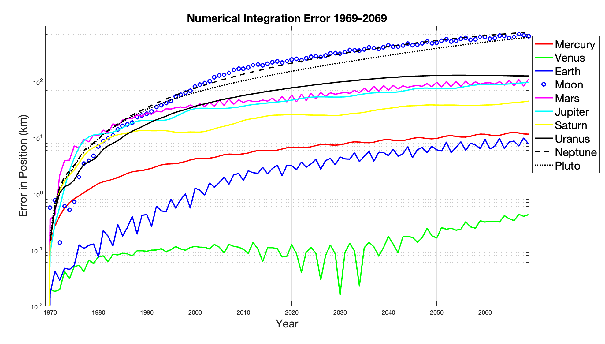

# JPL_Ephem
Attempt to reimplement the numerical integration used to construct JPL Ephemerides.

The implementation work is still in early stages. The implementation is heavily inspired by DE118i written by Steve Moshier [3].

The implementation is missing a proper integration scheme. In addition, the implementation has not been written for performance.

The position error w.r.t. JPL Horizons over 100-year integration with 864-second timesteps is shown below.
[]

## References
1. Newhall, Standish, Williams - DE 102: a numerically integrated ephemeris of the Moon and planets spanning forty-four centuries, Astronomy and Astrophysics, 125, 150-167, 1983.
2. Urban, Seidelmann - Explanatory Supplement to the Astronomical Almanac, 3rd edition, University Science Books, 2013.
3. Steve Moshier, DE118i available at [link](http://www.moshier.net/de118i-2.zip).
